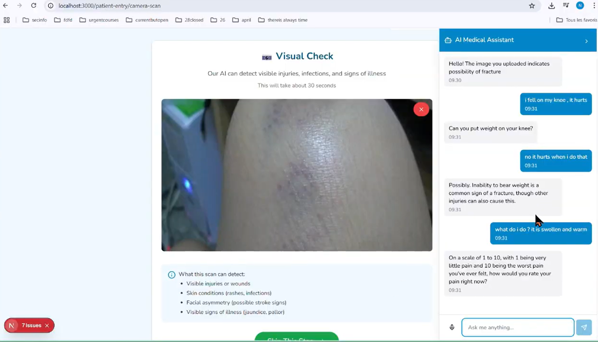

#  HealNet – Frontend

**HealNet** is a digital health application designed to support **war victims and refugees** by providing them with a **universal, easy-to-use medical record system**. Inspired by the **Global Citizen** concept, HealNet enables individuals to securely access and share their health information regardless of where they are in the world.

---
 

##  Project Goal

HealNet's mission is to **bridge the healthcare access gap for displaced communities**. Refugees and war survivors often lose access to their medical history — HealNet empowers them with a **portable digital health record** that:

* 🌐 Works across borders
* 📱 Is accessible from any device
* 🛡️ Keeps personal data secure
* 💬 Supports a user-friendly interface

---

## 🧩 This Repo: Frontend

This is the **frontend** part of the HealNet project. It serves as the **user interface** for interacting with medical records, authentication, and accessing essential health services. Built for **ease of use in emergency and low-connectivity situations**.

## 🖥️ Key Features

* **User Login/Register** (for patients & doctors)
  

* **Upload/View Medical Records**
* **Communicate in any language with the virtual doc**
  
  
* **Secure QR Code Sharing of Records**
*  **Simulate heartbeat with taps**
* **Minimalist UI for accessibility and clarity**
  
  
* **Designed for mobile-first experience**

